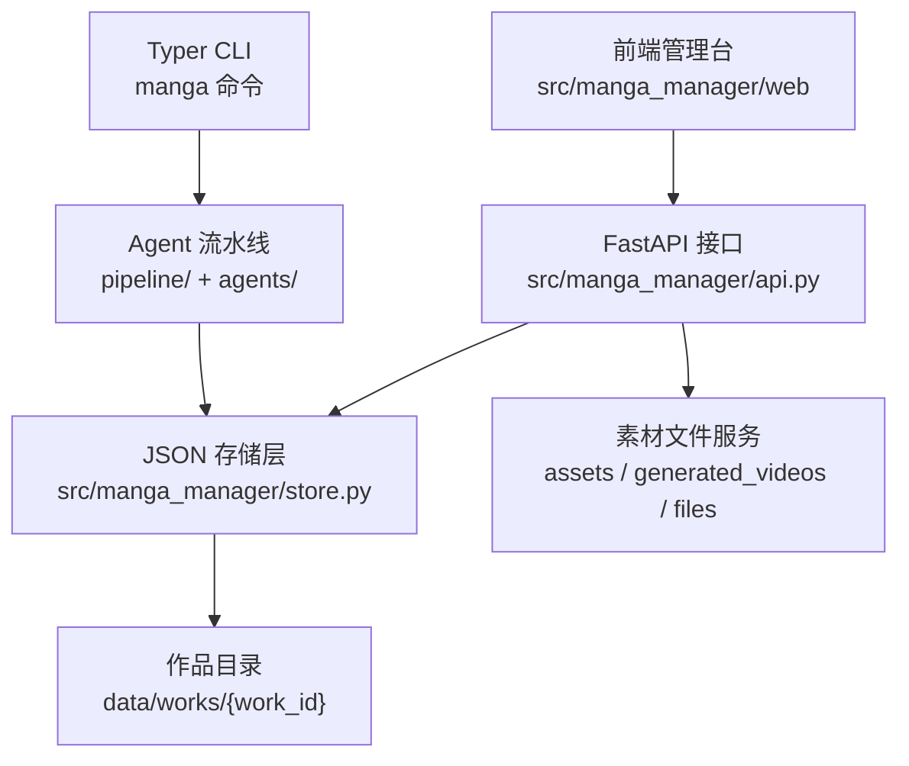

# AI 漫剧制作管理平台架构

## 目标定位

本项目是一个面向 AI 漫剧生产的本地制作管理平台。核心目标不是替代创作，而是把小说改编、设定沉淀、分镜生成、提示词生成、参考素材绑定和成片资产管理放进同一个可检查、可回滚、可人工干预的工作台。

平台采用“结构化 JSON 状态 + FastAPI 后端 + 静态前端”的轻量架构。所有作品数据保存在 `data/works/{work_id}/`，不依赖数据库，便于手动备份、版本管理和跨工具处理。

## 总体分层

## 核心领域对象

| 对象 | 存储位置 | 作用 |
|---|---|---|
| Work | `work.json` | 作品元数据、标题、状态、原文字数 |
| Source | `source.txt` | 小说原文，所有改编产物的根输入 |
| StyleGuide | `style_guide.json` | 项目级提示词配置：叙事、视觉、色彩、镜头、负面词 |
| Episode / Scene | `episodes/*.json` | 分集和场景序列，是制作进度的骨架 |
| Entity | `entities/*.json` | 人物、场景、物品设定，以及变体和参考素材绑定 |
| Shot | `shots/{scene_id}.json` | 单场景下的镜头脚本 |
| Binding | `bindings/{scene_id}.json` | 镜头角色到实体/变体的绑定 |
| Prompt | `video_prompts/{scene_id}.txt` | 单场景视频生成提示词 |
| Asset | `assets/{entity_id}/...` | 角色、场景、物品的参考图/音频/视频 |
| Generated Video | `generated_videos/{scene_id}/...` | 外部视频生成后的结果文件 |
| Operation | `operations.jsonl` | 操作日志，记录导入、编辑、删除等动作 |

## 前端视图

前端是由 FastAPI 托管的静态页面：

- `index.html`：页面框架、导航、弹窗根节点。
- `app.js`：所有接口调用、状态管理、列表渲染、弹窗逻辑。
- `styles.css`：管理台布局、折叠层级、素材卡片、配置窗口样式。

主要视图：

- 作品侧栏：新建、切换当前作品。
- 概览：阶段、剧集、场景、镜头、实体、提示词、素材等统计。
- 剧集：按集折叠，展示场景序列。
- 实体：按人物、场景、物品三类展示设定。
- 镜头：按“第几集 / 第几个序列 / 第几个镜头”分层折叠。
- 提示词：浏览和编辑单场景视频提示词。
- 素材：导入、查询、预览、编辑绑定、删除参考素材。
- 原文：查看和编辑 `source.txt`。
- 日志：查看最近操作记录。
- 项目提示词配置：编辑 `style_guide.json`。

## 后端接口边界

后端位于 `src/manga_manager/api.py`，只做三类事：

1. 把存储层模型转换为前端需要的 JSON。
2. 调用 `store.py` 的原子写入、锁和校验能力。
3. 提供文件下载/预览服务，并限制路径必须留在作品目录内。

关键接口：

| 能力 | 接口 |
|---|---|
| 作品列表 / 新建 / 激活 | `GET /api/works`, `POST /api/works`, `POST /api/works/{id}/activate` |
| 作品概览 | `GET /api/works/{id}/overview` |
| 剧集 / 实体 / 镜头树 | `GET /episodes`, `GET /entities`, `GET /shot-tree` |
| 单场景提示词 | `GET /prompts`, `GET /prompts/{scene_id}`, `PUT /prompts/{scene_id}` |
| 项目提示词配置 | `GET /prompt-config`, `PUT /prompt-config` |
| 素材 CRUD | `GET /assets`, `GET /assets/detail`, `POST /assets`, `PATCH /assets`, `DELETE /assets` |
| 原文 | `GET /source`, `PUT /source` |
| 校验 | `POST /validate` |
| 文件预览 | `GET /files/{relative_path}` |

## 素材 CRUD 设计

素材本体是作品目录中的真实文件，素材元数据是实体变体上的引用路径。一个素材的完整身份由以下信息组成：

- `path`：作品内相对路径，例如 `assets/ec6035a20/童年妹妹.png`。
- `kind`：`image | audio | video`。
- `entity_id`：绑定到哪个人物、场景或物品。
- `variant_label`：绑定到该实体的哪个变体。
- `url`：前端预览地址。

### Create

`POST /api/works/{work_id}/assets`

上传文件并绑定到实体变体。后端使用 `store.bind_ref_media` 复制文件到 `assets/{entity_id}/`，再把相对路径写入对应变体的 `ref_images/ref_audios/ref_videos`。

### Read

`GET /api/works/{work_id}/assets`

聚合所有实体变体上的媒体引用，返回素材列表。

`GET /api/works/{work_id}/assets/detail?path=...`

读取单个素材的绑定信息，用于编辑窗口。

### Update

`PATCH /api/works/{work_id}/assets?path=...`

更新素材绑定关系，包括实体、变体和类型。文件本体不移动，只调整实体 JSON 中的引用位置。这样可以避免改名/移动带来的文件丢失风险，也保持历史路径稳定。

### Delete

`DELETE /api/works/{work_id}/assets?path=...`

删除实体变体里的引用，并删除对应文件。删除操作会写入 `operations.jsonl`。

## 数据安全策略

- 写 JSON 使用 `write_json_atomic`，避免半写入文件。
- 写操作使用 `write_lock`，避免并发覆盖。
- 文件预览和删除都通过 `_safe_work_file` 校验，防止路径逃逸到作品目录外。
- 所有重要前端写操作都会记录 `operations.jsonl`。
- 素材更新只重绑引用，不移动原始文件，降低破坏性。

## 后续扩展方向

- 增加作品删除/归档和导出包。
- 增加素材标签、备注、评分和使用位置反查。
- 增加生成视频的 CRUD 与镜头/提示词绑定。
- 将长任务流水线接入 WebSocket 或后台任务队列。
- 增加差异预览和操作撤销。
